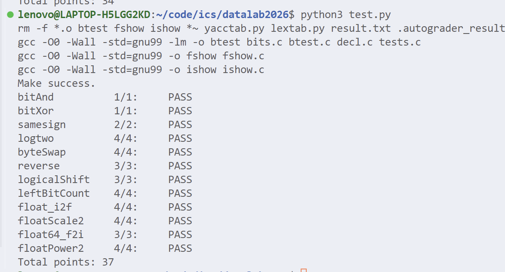

# datalab 报告

姓名：李昊森

学号：2025201790

|  总分 | bitAnd | bitXor | samesign | logtwo | byteSwap | reverse | logicalShift | leftBitCount | float_i2f | floatScale2 | float64_f2i | floatPower2 |
| ----: | -----: | -----: | -------: | -----: | -------: | ------: | -----------: | -----------: | --------: | ----------: | ----------: | ----------: |
| 37/37 |    1/1 |    1/1 |      2/2 |    4/4 |      4/4 |     3/3 |          3/3 |          4/4 |       4/4 |         4/4 |         3/3 |         4/4 |

test 截图：



<!-- TODO: 用一个通过的截图，本地图片，放到 imgs 文件夹下，不要用这个 github，pandoc 解析可能有问题 -->

## 解题报告

### 亮点

<!-- 告诉助教哪些函数是你实现得最优秀的，比如你可以排序。不需要展开，展开请放到后文中。 -->

1. reverse
2. logicalShift

### reverse

```c
unsigned reverse(unsigned v) {
    unsigned r = 0;
    int i;
    for (i = 0; !(i & 32); i++) {
        r = (r << 1) | (v & 1); /* 取出 v 的最低位，接到 r 的末尾 */
        v = v >> 1;             /* 把 v 右移，换下一位出场 */
    }
    return r;
}
```

因为reverse的时候不允许使用小于号和等于号，所以我直接用 !(i & 32) 这玩意作为循环终止条件了，很有趣

### logicalShift

```c
int logicalShift(int x, int n) {
    int mask = ~(((1 << 31) >> n) << 1);
    return (x >> n) & mask;
}
```

这个我用一行把mask表示出来了很有意思

因为我想要去除最前面的几位1，所以直接让他右移可以在前面补n个1，就很正确

## 参考的重要资料

ics课件的PPT
